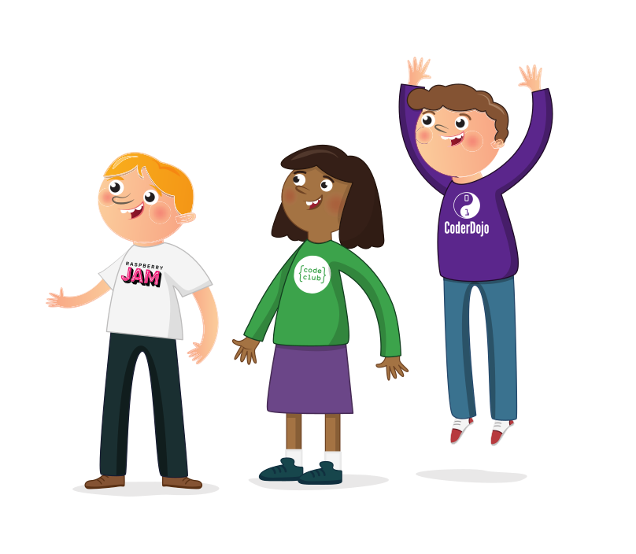

## ما هي حماية الطفل؟

الحماية هي الإجراءات المتّخَذى لتعزيز رفاهية الأطفال وحمايتهم من الأذى.

تأكّد من أنّك سجّلت دخولك إلى حساب مؤسّسة Raspberry Pi لحفظ تقدّمك، وإلّا فلن يُسجَّل إتمامك. استخدم رابط <a href="https://my.raspberrypi.org/login">"تسجيل الدخول"</a> في قائمة التنقّل لتسجيل الدخول.

أُنشِئَ دليل التعلّم هذا لمنح الفرصة لجميع المتطوّعين في مؤسّسة Raspberry Pi وبرامجهم (Code Club وCoderDojo وRaspberry Jams وAstro Pi)، للتعرّف على أفضل الممارسات في حماية الطفل.

بمجرّد إتمامه، ستحصل على:

* الوعي الأساسي بالقضايا الرئيسة المتعلّقة بحماية الطفل في نوادي Code Club
* فهم كيفيّة تنفيذ أفضل الممارسات الدوليّة في حماية الطفل

سيستغرق إكمال دليل التعلّم هذا حوالي 20 دقيقة.

### ما الموضوعات الّتي ستتمّ تغطيتها؟

هناك العديد من الطرق للتأكد من أن ناديك هو مكان آمن للشباب للتعلم والتعامل مع التكنولوجيا.

أدناه، بعض الموضوعات الّتي ستتمّ تغطيتها:

* فحص الخلفية
* التشريعات
* كيفيّة توظيف المتطوّعين
* قواعد السلوك
* أنواع الإساءة
* كيفية تنفيذ عمليات الإبلاغ عن الإساءة
* أمثلة عن سيناريوهات في Code Club
* كيفية إجراء جلسات آمنة عبر الإنترنت

### لماذا تعدّ حماية الطفل مهمّة؟

يجب أن تكون جميع البرامج الّتي تديرها وتدعمها مؤسّسة Raspberry Pi آمنة للجميع. من خلال المحافظة على بيئة آمنة، فإنّك تسمح للأطفال وبالنجاح وتعلّم البرمجة بشكل خالٍ من المشاكل.

من الممكن أن يكون في النوادي شباب من مختلف المدارس والخلفيات والأعمار. لذلك، من المهمّ التأكّد من حماية هذه المساحة الآمنة، لضمان تمكّن الأطفال من تكوين صداقات جديدة والمشاركة في الاهتمامات المشتركة.

### التشريعات

كلّ نادٍ مسؤول عن ضمان التزامه بتشريعات الحماية في منطقته. وستطلب بعض الولايات القضائية أن يجري جميع المتطوعين الذين يعملون مع الشباب و/أو الأشخاص المستضعفين التحقق من خلفيتهم قبل أن يبدؤوا بالنشاط التطوعي. وقد تطلّب الولايات القضائيّة الأخرى أن تكون لديك سياسة لحماية الطفل أو بين بالحماية.

**ملاحظة**: التشريعات في الولايات المتحدة الأمريكية يمكن أن تختلف من ولاية إلى أخرى.

### أفضل الممارسات

في حين أنه من المهمّ للغاية أن تتبع التشريعات في منطقتك فيما يتعلق بحماية الطفل، يجب على جميع الأندية محاولة الحصول على أفضل الممارسات، حتى عندما لا تكون مطلوبة بموجب التشريعات. تشمل بعض أفضل الممارسات التي يمكن لناديك اعتمادها والتي سيتم تغطيتها في هذه الوحدة ما يلي:

* توظيف المتطوّعين
* قواعد السلوك
* قواعد السلوك للأطفال الّذسن يحضرون الجلسات الإلكترونيّة عن بعد
* دليل للبالغين لدعم الأطفال الّذين يحضرون الجلسات الإلكترونيّة عن بعد
* عمليّة الإبلاغ عند اكتشاف إساءة حاصلة لمتطوّع، أو عندما يلاحظ متطوّع علامة من علامات سوء المعاملة
