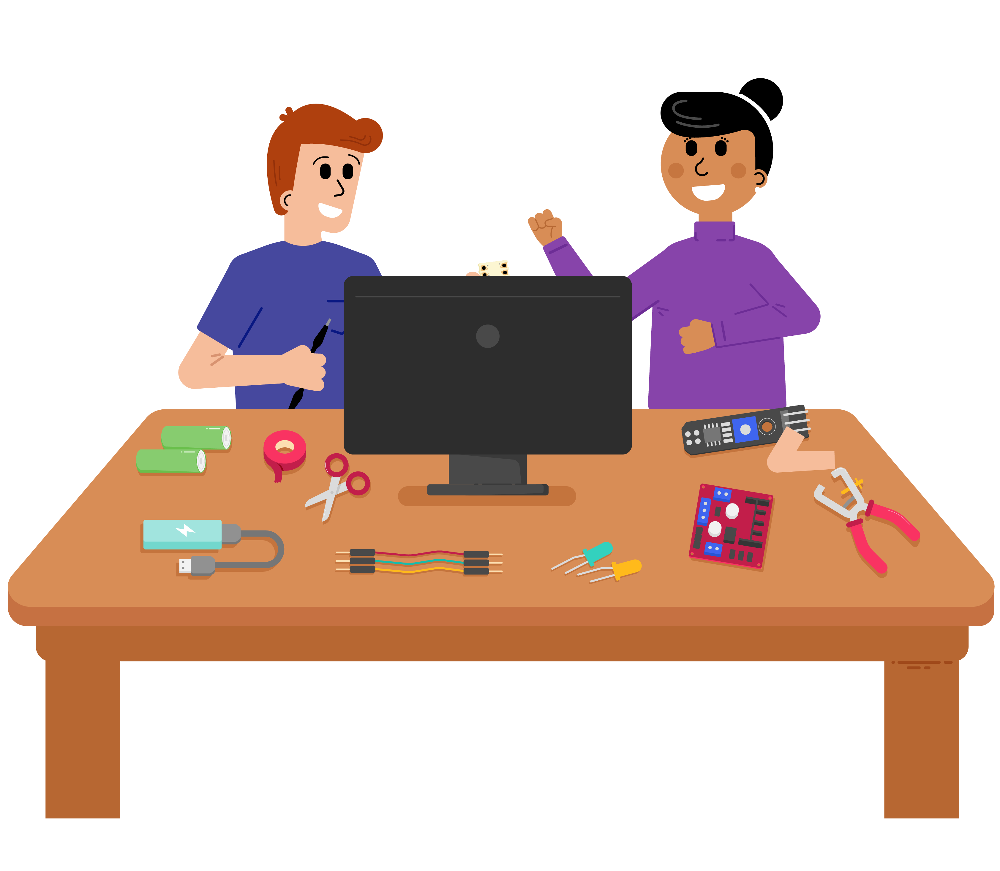

## Τι είναι η προστασία των παιδιών;

Προστασία των παιδιών είναι οι ενέργειες που λαμβάνονται ώστε τα παιδιά να ευημερούν και να προστατεύονται από βλάβες.

Βεβαιωθείτε ότι είστε συνδεδεμένοι στον λογαριασμό σας στο Raspberry Pi Foundation για να αποθηκεύσετε την πρόοδό σας, διαφορετικά η ολοκλήρωσή σας δεν θα καταγραφεί. Χρησιμοποιήστε το σύνδεσμο «Σύνδεση» στο μενού πλοήγησης για να συνδεθείτε.

Αυτός ο οδηγός εκμάθησης δημιουργήθηκε για να δώσει σε όλους τους εθελοντές του Ιδρύματος Raspberry Pi και των προγραμμάτων τους (Code Club, CoderDojo, Raspberry Jams και Astro Pi) την ευκαιρία να μάθουν για τις βέλτιστες πρακτικές στην προστασία των παιδιών.

Μόλις τον ολοκληρώσετε, θα έχετε:

* Βασική επίγνωση των κύριων θεμάτων σε σχέση με την προστασία των παιδιών σε μια λέσχη προγραμματισμού
* Κατανόηση του τρόπου εφαρμογής διεθνών βέλτιστων πρακτικών για την προστασία των παιδιών

Θα χρειαστούν περίπου 20 λεπτά για να ολοκληρωθεί αυτός ο οδηγός εκμάθησης.

### Ποια θέματα θα καλυφθούν;

Υπάρχουν πολλοί τρόποι για να διασφαλίσετε ότι η λέσχη σας είναι ένας ασφαλής χώρος για τους/τις νέους/ες να μάθουν και να ασχοληθούν με την τεχνολογία.

Παρακάτω είναι μερικά από τα θέματα που θα καλυφθούν:

* Έλεγχοι ιστορικού
* Νομοθεσία
* Πώς να στρατολογήσετε εθελοντές/τριες
* Κώδικας συμπεριφοράς
* Τύποι κακοποίησης
* Πώς να εφαρμόσετε διαδικασίες για την αναφορά κακοποίησης
* Παραδείγματα σεναρίων σε μια λέσχη προγραμματισμού
* Πώς να πραγματοποιείτε ασφαλείς διαδικτυακές συνεδρίες

### Γιατί είναι σημαντική η προστασία των παιδιών;

Όλα τα προγράμματα που εκτελούνται και υποστηρίζονται από το Raspberry Pi Foundation πρέπει να εμπνέουν ασφάλεια για όλους. Διατηρώντας ένα ασφαλές περιβάλλον, επιτρέπετε στους νέους να αναπτυχθούν και να μάθουν προγραμματισμό εντελώς ξένοιαστα.

Οι λέσχες μπορούν να έχουν νέους ανθρώπους που συμμετέχουν από διαφορετικά σχολεία, υπόβαθρα και ηλικίες. Ως εκ τούτου, είναι σημαντικό να διασφαλίσουμε ότι αυτός ο ασφαλής χώρος προστατεύεται για να διασφαλιστεί ότι οι νέοι/νέες μπορούν να κάνουν νέους/ες φίλους/ες και να μοιράζονται κοινά ενδιαφέροντα.

### Νομοθεσία

Κάθε λέσχη είναι υπεύθυνη να διασφαλίσει ότι συμμορφώνεται με τη νομοθεσία προστασίας της περιοχής της. Σε ορισμένες περιοχές θα απαιτηθεί από όλους τους εθελοντές που εργάζονται με νέους και/ή ευάλωτα άτομα να υποβάλλονται σε έλεγχο ιστορικού πριν ξεκινήσουν την εθελοντική δραστηριότητα. Σε άλλες περιοχές ενδέχεται να απαιτείται να έχετε μια πολιτική προστασίας των παιδιών ή μια δήλωση προστασίας.

**Σημείωση**: Η νομοθεσία στις ΗΠΑ μπορεί να διαφέρει από πολιτεία σε πολιτεία.

### Βέλτιστες πρακτικές

Αν και είναι υψίστης σημασίας να ακολουθείτε τη νομοθεσία της περιοχής σας σχετικά με την προστασία των παιδιών, όλες οι λέσχες θα πρέπει να προσπαθήσουν να εφαρμόζουν βέλτιστες πρακτικές, ακόμη και όταν δεν απαιτούνται από τη νομοθεσία. Μερικές από τις βέλτιστες πρακτικές που μπορεί να υιοθετήσει η λέσχη σας και θα καλυφθούν σε αυτήν την ενότητα περιλαμβάνουν:

* Προσέγγιση Εθελοντών/τριών
* Κώδικας συμπεριφοράς
* Κώδικας συμπεριφοράς για παιδιά που παρακολουθούν διαδικτυακές συνεδρίες
* Οδηγός για ενήλικες για την υποστήριξη παιδιών που παρακολουθούν διαδικτυακές συνεδρίες
* Η διαδικασία αναφοράς όταν αποκαλύπτεται η κακοποίηση σε έναν εθελοντή ή όταν ένας εθελοντής παρατηρεί σημάδια κακοποίησης
