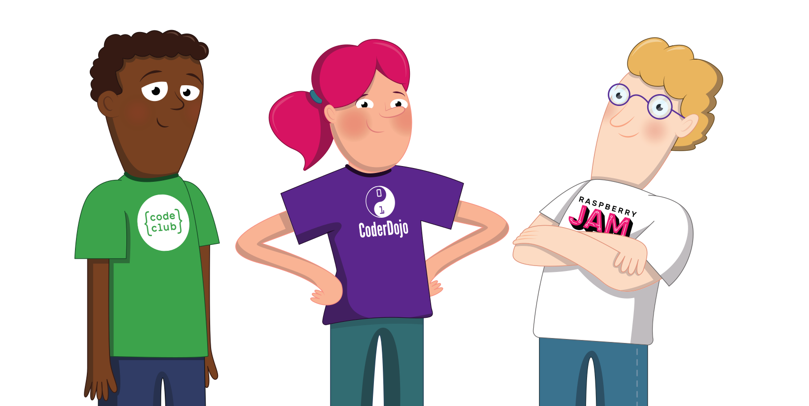

## Διαδικασία προσέγγισης

Συνήθως, είναι ευθύνη του/της διοργανωτή/ριας της λέσχης να προσεγγίζει και να ενσωματώνει νέους/νέες εθελοντές/τριες. Από καιρό σε καιρό, εθελοντές μπορεί να συμμετέχουν σε αυτή τη διαδικασία για να βοηθήσουν τον διοργανωτή της λέσχης, ιδιαίτερα για να βοηθήσουν στην καθοδήγηση του νέου εθελοντή στην πρώτη του συνεδρία.

Είναι σημαντικό να αναγνωρίσετε ότι κάθε εθελοντής που ενδιαφέρεται να βοηθήσει στη λέσχη σας δεν είναι κατάλληλος ή ενδέχεται να μην ταιριάζει.

Μια διαδικασία προσέγγισης καθιστά ευκολότερο τον εντοπισμό εθελοντών που δεν είναι κατάλληλοι για τη λέσχη. Ακολουθεί ένα παράδειγμα διαδικασίας προσέγγισης.

### 1. Περιγραφή εθελοντή/τριας

Αυτή είναι μια σύντομη περιγραφή για να πείτε στους πιθανούς εθελοντές τι περιλαμβάνει ο ρόλος και για να δώσετε μια ευρεία επισκόπηση της λέσχης σας. Αυτό θα μπορούσε να είναι μια σύντομη περιγραφή στον ιστότοπό σας ή ένα προφίλ του ρόλου ενός εθελοντή στη λέσχη σας. Θα πρέπει να περιλαμβάνει:

* Τι συμβαίνει σε μια τυπική συνεδρία;
* Πόσο συχνά λειτουργεί η λέσχη σας και για πόσο;
* Πόσο χρόνο χρειάζεστε από τους εθελοντές σας;

### 2. Φόρμα αίτησης

Αυτή μπορεί να είναι μια ηλεκτρονική φόρμα με μερικές σύντομες ερωτήσεις. Θα πρέπει να ζητήσετε κάποιον που να εγγυάται, εάν είναι δυνατόν, και οποιεσδήποτε σχετικές δεξιότητες που μπορεί να είναι χρήσιμες στη λέσχη σας. Πληροφορίες από τη φόρμα της αίτησης, όπως στοιχεία επικοινωνίας, θα είναι χρήσιμες εάν αυτός ο υποψήφιος εθελοντής ενταχθεί στη λέσχη.

**Σημείωση**: Εάν βρίσκεστε σε Code Club ή CoderDojo, αντί για μια φόρμα αίτησης, θα πρέπει να ενθαρρύνετε πιθανούς εθελοντές να εγγραφούν μέσω των ιστοσελίδων μας ([codeclub.org](https://codeclub.org){:target='_blank'} και [coderdojo.com](https://coderdojo.com){:target='_blank'}).

### 3. Άτυπη συνάντηση ή συνέντευξη

Προσκαλέστε το άτομο στη λέσχη για να μπορέσετε να συναντηθείτε μαζί του και να μάθει περισσότερα για το περιβάλλον της λέσχης. Εάν η λέσχη σας εκτελεί δραστηριότητες στο διαδίκτυο, τότε μπορείτε να συναντηθείτε εξ αποστάσεως. Θα πρέπει να είναι μια χαλαρή συνάντηση, αλλά θα πρέπει να δώσει στους ήδη συμμετέχοντες εθελοντές της λέσχης και στον δυνητικό εθελοντή την ευκαιρία να πάρουν μια απόφαση σχετικά με το εάν θέλουν ο δυνητικός εθελοντής να προχωρήσει στον εθελοντισμό. Αυτό θα επιτρέψει επίσης στους σημερινούς εθελοντές του συλλόγου και στον δυνητικό εθελοντή να δουν αν μπορούν να συνεργαστούν καλά στο περιβάλλον της λέσχης. Εάν ξεκινάτε τη λέσχη σας για πρώτη φορά, θα πρέπει να οργανώσετε μια χαλαρή συνάντηση με τον πιθανό εθελοντή σας πριν από την πρώτη σας συνεδρία.

### 4. Έλεγχοι ιστορικού (ανάλογα με την περιοχή)

Οι έλεγχοι ιστορικού είναι χρήσιμοι για εθελοντικές λέσχες προγραμματισμού. Σε ορισμένες περιοχές ο έλεγχος ιστορικού είναι υποχρεωτικός για την εργασία με νέους. Κατανοούμε ότι σε ορισμένες περιοχές είναι πιο δύσκολη η πρόσβαση σε ελέγχους ιστορικού ή ότι μπορεί να είναι ακριβή διαδικασία, γι' αυτό είναι σημαντικοί οι έλεγχοι αναφοράς και η χρήση της υπόλοιπης διαδικασίας στρατολόγησης εθελοντών.

### 5. 'Ατομα που εγγυώνται για τον υποψήφιο εθελοντή (προαιρετικά)

Μπορεί να είναι πραγματικά χρήσιμο να ζητήσετε άτομα που να εγγυώνται για τον εθελοντή και να ελέγξετε αυτές τις αναφορές για να προσδιορίσετε εάν ένας εθελοντής είναι κατάλληλος να εργαστεί με νέους ή/και ευάλωτους ενήλικες.

Εάν έχετε το δικό σας έντυπο αίτησης, θα μπορούσατε να το χρησιμοποιήσετε ως χώρο για να ζητήσετε λεπτομέρειες σχετικά με τους ανθρώπους που εγγυώνται. Εάν δεν αναφέρονται άνθρωποι που εγγυώνται στη φόρμα αίτησης, μπορείτε να τους ζητήσετε μετά την χαλαρή συνάντηση. Οι άνθρωποι που εγγυώνται μπορεί να είναι συνάδελφοι, δάσκαλοι, διδάσκοντες ή φίλοι που γνωρίζουν καλά τον δυνητικό εθελοντή. Οι εθελοντές/τριες μπορούν να συστηθούν στη λέσχη από άλλον υπάρχοντα εθελοντή του συλλόγου, αυτό το άτομο μπορεί επίσης να ενεργήσει ως άνθρωπος που εγγυάται.

**Συμβουλή**: Όταν ελέγχετε αναφορές, είναι συχνά καλύτερο να τηλεφωνείτε στον άνθρωπο που εγγυάται, καθώς μπορεί να έχουν την τάση να δίνουν μια πιο ειλικρινή οπτική από ό, τι γραπτώς.

--- save ---

Βεβαιωθείτε ότι είστε συνδεδεμένοι στον λογαριασμό σας στο Raspberry Pi Foundation για να αποθηκεύσετε την πρόοδό σας, διαφορετικά η ολοκλήρωσή σας δεν θα καταγραφεί. Χρησιμοποιήστε το σύνδεσμο «Σύνδεση» στο μενού πλοήγησης για να συνδεθείτε.

