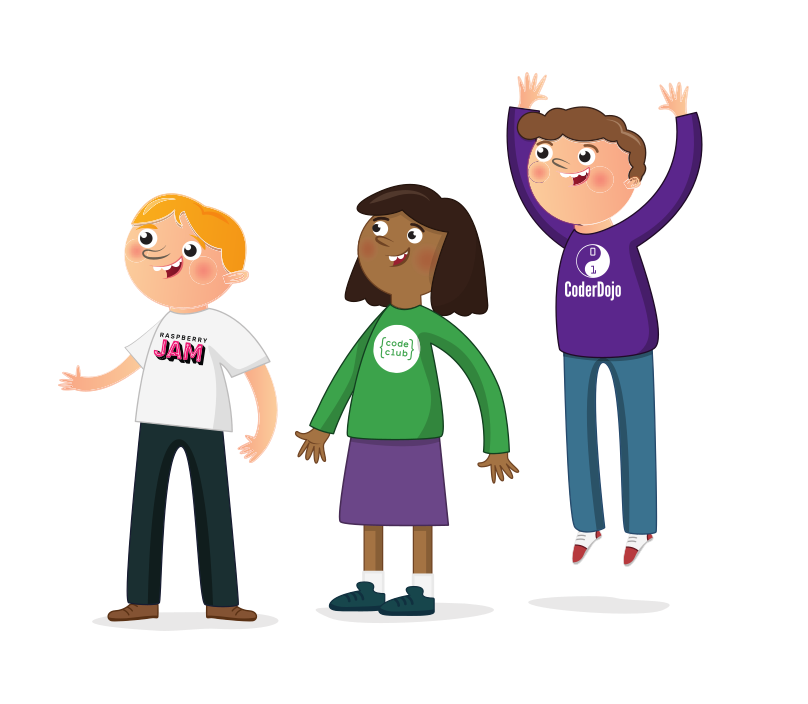

## チャイルド・セーフガードとは何ですか?

セーフガードとは、子どもの福祉を促進し、子どもを危険から守るためにとられる行動をいう。

Raspberry Pi Foundation アカウント にログインしていることを確認して進行状況を保存してください。それ以外の場合、完了情報は記録されません。 ナビゲーションメニューの<a href="https://my.raspberrypi.org/login">「ログイン」</a>リンクからログインしてください。

この学習ガイドは、Raspberry Pi財団のすべてのボランティアとそのプログラム(コードクラブ) を提供するために作成されました。 CoderDojo、Raspberry Jams、Astro Piは、児童保護のベストプラクティスについて学ぶ機会です。

完成後、直ちに:

* コーディングクラブにおける子どもの安全保護に関連する重要事項の基本的な認識
* 子どもの保護に関する国際的なベストプラクティスの実施方法に関する理解

このラーニングガイドは約20分で終了します。

### どのようなトピックがカバーされますか？

クラブを、若者がテクノロジーを学び、関わることができる安全な場所にするための方法はたくさんあります。

以下は、そのトピックの一部です。

* 身元確認
* 法規制
* ボランティアの募集方法
* 行動規範
* 虐待のタイプ
* 虐待を報告するためのプロセスの導入方法
* コーディングクラブでのシナリオの例
* 安全なオンラインセッションのやり方

### なぜ子どもの保護が重要なのか？

ラズベリーパイ財団が運営・支援するすべてのプログラムは、常に誰にとっても安全な空間であるべきです。 安全な環境を維持することで、若者を成長させ、完全に気ままにコーディングを学ばせることができるのです。

クラブには、さまざまな学校、背景、年齢の若者が参加することができます。 したがって、若者が新しい友人を作り、共通の関心を持つことができるように、この安全な空間を確実に保護することが極めて重要なのです。

### 法規制

各クラブは、各地域の保護に関する法令を遵守する責任があります。 管轄区域によっては、青少年および弱者、またはそのいずれかと活動するすべてのボランティアが、ボランティア活動を開始する前に身元調査を受けることを要求する場合があります。 その他の管轄区域では、児童保護方針または保護声明書を作成するよう求められる場合があります。

**注意事項**。米国の法律は、州によって異なる場合があります。

### ベストプラクティス

子どもの保護に関する地域の法律に従うことが最も重要ですが、法律で義務付けられていない場合でも、すべてのクラブはベストプラクティスを実施するよう努力すべきです。 クラブが、このモジュールで取り上げ、採用できるベストプラクティスには、次のようなものがあります。

* ボランティア募集
* 行動規範
* オンラインセッションに参加する若者のための行動規範
* オンラインセッションに参加する若者をサポートする大人のためのガイド
* ボランティアに虐待が申告された場合、あるいはボランティアが虐待の兆候に気づいた場合の報告プロセス
