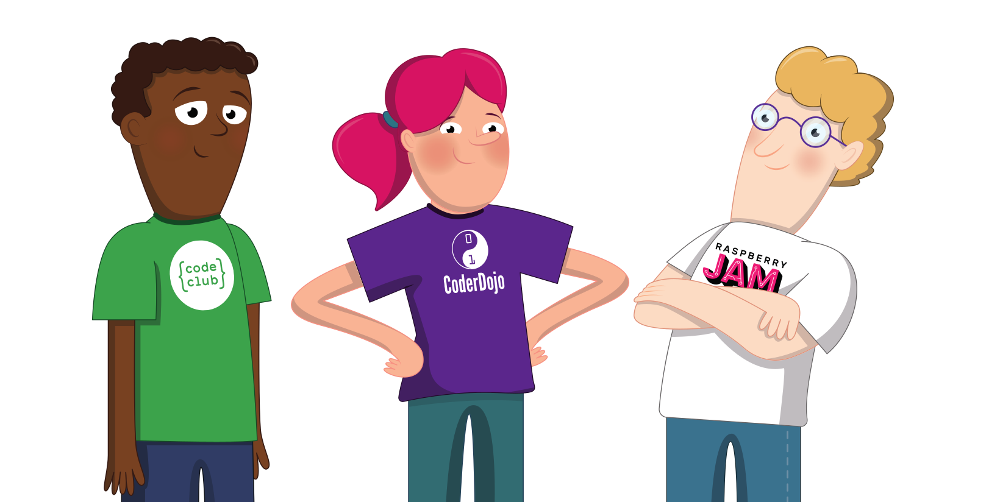

## 採用の流れ

通常、新しいボランティアを募集し、加入させるのは、クラブの主催者の責任です。 時折、クラブ主催者をサポートするためにボランティアがこのプロセスに参加することがあります。特に、新しいボランティアが最初のセッションで指導するサポートをする場合があります。

クラブでの支援に関心を持つすべてのボランティアが適切であったり、マッチングするわけではないことを認識することが重要です。

採用プロセスは、クラブにふさわしくないボランティアを特定するのを容易にします。 ここでは、採用活動の一例をご紹介します。

### 1. ボランティアの内容

これは、ボランティア候補者に役割の内容を伝え、クラブの概要を広く知ってもらうための簡単な説明文です。 これは、ウェブサイトに掲載する簡単な説明や、ボランティアの役割に関するクラブのプロフィールなどです。 以下を含みます。

* 典型的なセッションでは何が起こっているのですか？
* クラブはどれくらいの頻度で、どれくらいの期間運営されているのですか？
* ボランティアにはどれくらいの時間が必要ですか？

### 2. 申込書

これは、何問かの短い質問からなるオンラインフォームでも構いません。 可能であれば審判員を要求し、クラブで役立つ関連スキルがあれば教えてもらうとよいでしょう。 連絡先など、応募用紙に記載された情報は、このボランティア候補者がクラブに入会した際に役立つものです。

**注意**: Code ClubまたはCoderDojoに参加している場合は、申込書ではなく、ボランティア候補者へ私たちのウェブサイト（[codeclub.org](https://codeclub.org){:target='_blank'}および[coderdojo.com](https://coderdojo.com){:target='_blank'}）を通じて登録するように勧めてください。

### 3. 非公式の会議または面接

その人をクラブに招待し、面会して、その人がクラブの環境についてもっと知ることができるようにしてください。 クラブがオンラインで活動を展開しているのであれば、遠隔地でのミーティングも可能です。 それはカジュアルな会合であるべきですが、現在のクラブ・ボランティアとボランティア候補者が、ボランティア候補者にボランティア活動を進めてほしいかどうかを判断する機会を提供する必要があります。 また、現在のクラブボランティアとボランティア候補者が、クラブという場でうまく協力できるかどうかを確認することもできます。 初めてクラブを始める場合、最初のセッションの前に、ボランティア候補者との非公式のミーティングを設定するとよいでしょう。

### 4. 身元確認（地域により異なる）

身元調査は、任意のコーディング・クラブに有効です。地域によっては、青少年と活動するために身元調査が義務付けられています。 地域によっては、身元調査を受けるのが難しい、あるいは費用がかかるということも理解しています。そのため、身元調査やその他のボランティア募集のプロセスを活用することが重要なのです。

### 5. 審判員（オプション）

ボランティアが若者や弱い立場の人と働くのに適しているかどうかを判断するために、推薦人を依頼し、その推薦人を確認することは非常に有効な手段です。

独自の応募用紙がある場合は、査読者の詳細を尋ねるスペースとして利用することも可能です。 応募フォームで審判員を集めていない場合は、内定者懇談会後に審判員をお願いすることもできます。 推薦者は、同僚、教師、講師、またはボランティア候補者をよく知っている友人でもかまいません。 ボランティアは、既存のクラブボランティアから紹介を受け、その人がレフリーとして活動することも可能です。

**ヒント**: 推薦状をチェックするときは、推薦者に電話をするのがベストです。なぜなら、推薦者は書面よりも正直な意見を述べる傾向があるからです。

--- save ---

Raspberry Pi Foundation アカウント にログインしていることを確認して進行状況を保存してください。それ以外の場合、完了情報は記録されません。 Use the 'Log in' link in the navigation menu to log in.

