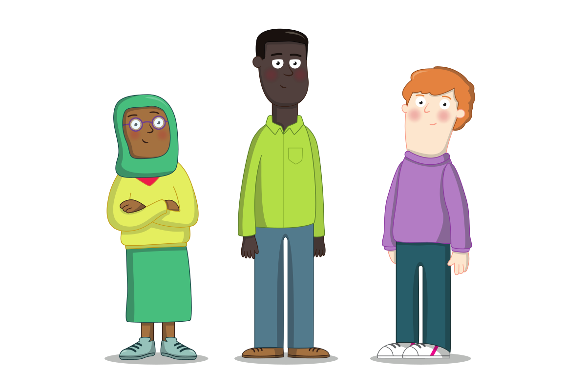

## गैरवर्तणूक आणि प्रकटीकरण

बहुसंख्य तरुण लोकांना गैर वर्तणुकीचा सामना न करता आमच्या क्लबमध्ये भाग घेतात. However, it is important that volunteers maintain an attitude of 'it could happen here' and are aware of what to do when they become aware of abuse, either through observation or through a young person telling them about abuse (disclosure). Although volunteers may not spend a large amount of time with each young person compared to teachers in schools, Raspberry Pi Foundation clubs create an environment in which many young people feel particularly comfortable, which can help encourage disclosures at the club.

{:target='_blank'}

बाल शोषण सामान्यतः दुर्लक्ष, शारीरिक शोषण, भावनिक शोषण, लैंगिक अत्याचार किंवा संघिकरणाच्या रूपता वर्गीकृत केले जाते. इतर पैलूंबद्दल जागरूक असण्यामध्ये समवयस्कांचा गैरवापर, संघटित गैरवर्तणूक आणि ऑन लाइन गैर वर्तणूक यांचा समावेश आहे.

### गैरवर्तणूकीचे प्रकार: दुर्लक्ष

दुर्लक्ष हे वगळण्याच्या दृष्टीने परिभाषित केले जाऊ शकते, जेथे एखाद्या तरुणाला व्यक्तीला अन्न, वस्त्र, उबदारपणा, स्वच्छता, बौद्धिक उत्तेजन, पर्यवेक्षण आणि सुरक्षितता, बौद्धिक चालना, पर्यवेक्षण आणि सुरक्षेपासून वंचित राहून लक्षणीय हानी किंवा विकासात कमतरता येते. वैद्यकीय सुविधा/प्रौढांप्रती अनावश्यक आसक्ती दिसून येते.

[NSPCC (युके) तर्फे अतिरिक्त संसाधने आणि व्याख्या](https://www.nspcc.org.uk/what-is-child-abuse/types-of-abuse/neglect/){:target='_blank'}

### गैरवर्तणूकीचे प्रकार: शारीरिक गैर वर्तणूक

तरुण व्यक्तीशी शारीरिक गैर वर्तणूक म्हणजे अशी कृती, किंवा कृती शिवाय, जी वास्तविक किंवा संभाव्य शारीरिक हानीमध्ये परिणामित होते, जी पालक किंवा जबाबदार पदावर, सामर्थ्य, किंवा विश्वास या स्थानी असलेली व्यक्ती यांच्या नियंत्रणामध्ये वाजवी रित्या आहे. एक किंवा पुनरावृत्ती घटना असू शकतात.

शारीरिक गैरवर्तणूकीमध्ये समावेश असू शकतो:

* गंभीर शारीरिक शिक्षा
* मारणे, थोबडीत मारणे, बुक्क्या किंवा लाथा
* ढकलणे, हलवणे किंवा फेकणे
* धमक्यांना घाबरणे

[NSPCC (युके) तर्फे अतिरिक्त संसाधने आणि व्याख्या](https://www.nspcc.org.uk/what-is-child-abuse/types-of-abuse/physical-abuse/){:target='_blank'}

### गैरवर्तणूकीचे प्रकार: भावनिक अत्याचार

भावनिक शोषण हे सामान्यतः एखाद्या विशिष्ट घटना किंवा पद्धतीच्या नमुन्यात न होता पालक, सांभाळणारे किंवा काळजीवाहक आणि तरुण व्यक्ती यांच्यातील नातेसंबंधात आढळतात. तरुणांना प्रेम, मान्यता, सातत्य आणि सुरक्षितता हवी वाटते पण ती मिळत नाही तेव्हा हे होते. हे क्वचितच शारीरिक लक्षणे दृष्टीने दिसून येते.

उदाहरणार्थ:

* सतत टीका करणे
* विचित्र वर्तन किंवा खुनशीपणा
* भावनात्मक अनुपलब्धता
* अयोग्य किंवा कठोर शिस्तीच्या उपायांचा वापर

[NSPCC (युके) तर्फे अतिरिक्त संसाधने आणि व्याख्या](https://www.nspcc.org.uk/what-is-child-abuse/types-of-abuse/emotional-abuse/){:target='_blank'}

### अत्याचाराचे प्रकार: लैंगिक शोषण

लैंगिक शोषण तेव्हा होते जेव्हा एखादी तरुण व्यक्ती दसर्‍या व्यक्तीकडून त्यांच्या समाधानासाठी किंवा लैंगिक उत्तेजनासाठी किंवा इतरांसाठी वापरली जाते. ह्यासाठी प्रत्यक्ष संपर्क नसला तरी हे ऑन लाईन देखील होऊ शकते. काही वेळा तरुण व्यक्तीला हे समजत नाही की त्यांच्या सोबत जे काही होत आहे ते गैरवर्तूणक आहे. कदाचित त्यांना ते चुकीचे आहे हे समजणार नाही.

[NSPCC (यूके) तर्फे अधिक संसाधने आणि व्याख्या](https://www.nspcc.org.uk/what-is-child-abuse/types-of-abuse/child-sexual-abuse/)

### गैरवर्तणूकीचे प्रकार: मूलगामी करण किंवा कट्टरपंथीयता

कट्टरपंथीयतेचा धोका असलेले तरुण इतर प्रकारच्या गैरवर्तणूकीचे बळी असू शकतात, जसे की गुंडगिरी किंवा भेदभाव, ज्यामुळे ते अतिरेकी वागणाऱ्यांना भक्ष बनतात.

मूलगामीपणा लक्षात घेणे कठीण आहे, कारण ते काही सामान्य किशोरवयीन वर्तणुकीसारखेच असते. एखादी व्यक्ती किंवा गट एखाद्या तरुण व्यक्तीला कट्टरपंथी बनवण्याचा प्रयत्न करत असल्याची काही चिन्हे येथे दिली आहेत:

- तरुण स्वतःला परिवार आणि मित्रांपासून वेगळे ठेवतात
- तरुण जणू लिखित दस्तऐवज वाचल्याप्रमाणे बोलतात
- तरुण त्यांची मते मांडण्यास असमर्थ आहेत किंवा त्यांना ह्यात स्वारस्य वाटत नाही
- तरुण अचानक इतरांविषयी अपमानास्पद वागतात
- तरुणांमध्ये रागाचे प्रमाण वाढते आहे
- तरुण व्यक्ती अत्यंत गोपनीयता बाळगतात, विशेषतः इंटरनेट वापर विषयक

[NSPCC (यूके) तर्फे अधिक संसाधने आणि व्याख्या](https://www.nspcc.org.uk/keeping-children-safe/reporting-abuse/dedicated-helplines/protecting-children-from-radicalisation/)

--- save ---

आपण आपल्या Raspberry Pi Fफाउंडेशन खात्यातलॉगिन होऊन आपली प्रगती जतन करा नाही तर त्याशिवाय ती जतन केली जाणार नाही. Use the 'Log in' link in the navigation menu to log in.

