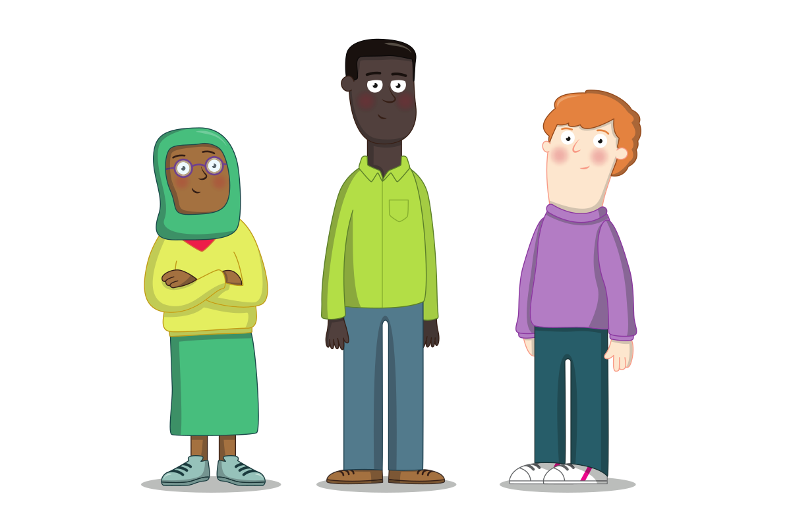

## Het signaleren en melden van misbruik

Een overgrote meerderheid van de jongeren neemt deel aan onze clubs zonder te worden misbruikt. Het is echter belangrijk dat vrijwilligers weten wat ze moeten doen als ze zich bewust worden van mishandeling, hetzij door observatie, hetzij door een jongere die je over misbruik vertelt (openbaarmaking). De meeste Raspberry Pi Foundation clubs creëren een omgeving waarin veel jonge mensen zich bijzonder op hun gemak voelen, wat kan helpen om onthullingen in de club te stimuleren.

{:target='_blank'}

Kindermishandeling wordt over het algemeen gecategoriseerd als verwaarlozing, lichamelijke mishandeling, emotionele mishandeling, seksueel misbruik of radicalisering. Andere aspecten om rekening mee te houden zijn onder meer misbruik door leeftijdsgenoten, georganiseerd misbruik en online misbruik.

### Soorten misbruik: verwaarlozing

Verwaarlozing kan worden gedefinieerd in termen van een omissie, waarbij een jongere aanzienlijke schade lijdt of in zijn ontwikkeling belemmerd wordt doordat hij wordt beroofd van voedsel, kleding, warmte, hygiëne, intellectuele stimulatie, toezicht en veiligheid, gehechtheid aan en genegenheid van volwassenen, en/of medische zorg.

[Verdere bronnen en definitie van de NSPCC (VK)](https://www.nspcc.org.uk/what-is-child-abuse/types-of-abuse/neglect/){:target='_blank'}

### Soorten mishandeling: fysieke mishandeling

Lichamelijke mishandeling van een jongere is datgene wat resulteert in feitelijke of potentiële fysieke schade door een interactie, of een gebrek aan interactie, die redelijkerwijs binnen de macht ligt van een ouder of persoon in een positie van verantwoordelijkheid, macht of vertrouwen. Er kunnen eenmalige of herhaalde incidenten zijn.

Lichamelijke mishandeling kan betrekking hebben op:

* Zware fysieke straffen
* Slaan of schoppen
* Duwen, schudden of gooien
* Terroriseren met bedreigingen

[Verdere bronnen en definitie van de NSPCC (VK)](https://www.nspcc.org.uk/what-is-child-abuse/types-of-abuse/physical-abuse/){:target='_blank'}

### Soorten mishandeling: emotionele mishandeling

Emotioneel misbruik komt normaal gesproken voor in de relatie tussen een ouder, voogd of verzorger en een jongere, en niet in een specifieke gebeurtenis of patroon van gebeurtenissen. Het treedt op wanneer niet wordt voldaan aan de behoeften van een jongere aan genegenheid, goedkeuring, consistentie en veiligheid. Het manifesteert zich zelden in termen van lichamelijke symptomen.

Bijvoorbeeld:

* Aanhoudende kritiek
* Sarcasme of vijandigheid
* Emotionele onbeschikbaarheid
* Gebruik van onredelijke of harde disciplinaire maatregelen

[Verdere bronnen en definitie van de NSPCC (VK)](https://www.nspcc.org.uk/what-is-child-abuse/types-of-abuse/emotional-abuse/){:target='_blank'}

### Soorten misbruik: seksueel misbruik

Er is sprake van seksueel misbruik wanneer een jongere door een ander wordt gebruikt voor zijn of haar bevrediging of seksuele opwinding, of voor die van anderen. Dit hoeft geen fysiek contact te zijn en kan online gebeuren. Soms zal de jongere niet begrijpen dat wat er met hem gebeurt misbruik is. Ze begrijpen misschien niet eens dat het verkeerd is.

[Verdere bronnen en definitie van de NSPCC (VK)](https://www.nspcc.org.uk/what-is-child-abuse/types-of-abuse/child-sexual-abuse/)

### Soorten misbruik: radicalisering

Jongeren die het risico lopen te radicaliseren, kunnen het slachtoffer zijn van andere vormen van misbruik, zoals pesten of discriminatie, waardoor ze een gemakkelijk doelwit zijn voor extremisten.

Radicalisering kan moeilijk op te merken zijn, omdat het vergelijkbaar is met normaal tienergedrag. Hier zijn enkele tekenen dat een persoon of groep een jongere zou kunnen radicaliseren:

- De jongere isoleert zich van familie en vrienden
- De jongere praat alsof uit een geschreven toespraak
- De jongere is niet bereid of niet in staat om over zijn of haar mening te praten
- De jongere vertoont een plotseling respectloze houding ten opzichte van anderen
- De jongere heeft een verhoogde mate van woede
- De jongere doet steeds geheimzinniger, vooral rond internetgebruik

[Verdere bronnen en definitie van de NSPCC (VK)](https://www.nspcc.org.uk/keeping-children-safe/reporting-abuse/dedicated-helplines/protecting-children-from-radicalisation/)

--- save ---

Zorg ervoor dat je bent ingelogd op je Raspberry Pi Foundation account om je voortgang op te slaan, anders word je eindresultaat niet geregistreerd. Gebruik de 'Inloggen' link in het navigatiemenu om in te loggen.

